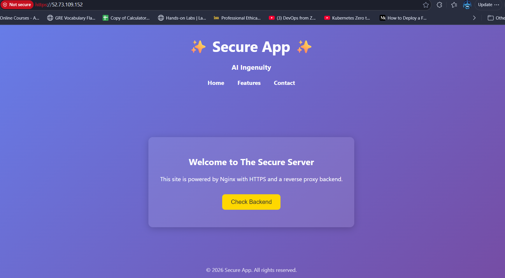
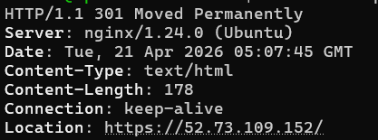
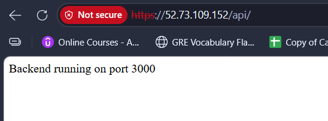

# 🚀 Secure Nginx Web Server on EC2 with HTTPS, SSL & Reverse Proxy

This project sets up a **production-like secure web server** using **Nginx** on an **AWS EC2 instance**.  
It includes static site hosting, HTTPS with self-signed SSL, HTTP→HTTPS redirection, and a reverse proxy to a Node.js backend.

---

## 📌 Features
- Static website served via Nginx
- HTTPS enabled with self-signed SSL certificate
- Automatic HTTP → HTTPS redirection
- Reverse proxy to backend (Node.js on port 3000)
- Backend managed with PM2 for persistence across reboots

---

## 📸 Screenshots

### 1. HTTPS Working


### 2. HTTP → HTTPS Redirect


### 3. Backend Running via Reverse Proxy


---

## 🛠️ Setup Steps

### 1. Update & Install Packages
- `sudo apt update && sudo apt upgrade -y`
- `sudo apt install nginx openssl -y`
- `sudo apt install nodejs`
- `sudo apt install npm -y`
- `npm init -y`
- `npm install express`

### 2. Create Web Root
- `sudo mkdir -p /var/www/secure-app`

### 3. Generate SSL Certificate
- `sudo mkdir -p /etc/nginx/ssl`
- `sudo openssl req -x509 -nodes -days 365 -newkey rsa:2048 -keyout /etc/nginx/ssl/secure-app.key -out /etc/nginx/ssl/secure-app.crt`

### 4. Configure Nginx
- `sudo vi /etc/nginx/sites-available/secure-app`
- `sudo ln -s /etc/nginx/sites-available/secure-app /etc/nginx/sites-enabled/`

### 5. Backend Setup
```js
cat <<EOF > app.js
const express = require('express');
const app = express();
app.get('/', (req, res) => res.send('Backend running on port 3000'));
app.listen(3000, () => console.log('Backend started on port 3000'));
EOF
```

### 6. Manage Backend with PM2
- `sudo npm install -g pm2`
- `pm2 start app.js`
- `pm2 startup systemd`
- `pm2 save`
- `pm2 list`

### 7. Test & Reload Nginx
- ` sudo nginx -t`
- ` sudo systemctl reload nginx`

### 8. Nginx Config
```js
server {
    listen 80;
    server_name 52.73.109.152;
    return 301 https://$host$request_uri;
}

server {
    listen 443 ssl;
    server_name 52.73.109.152;

    ssl_certificate /etc/nginx/ssl/secure-app.crt;
    ssl_certificate_key /etc/nginx/ssl/secure-app.key;

    root /var/www/secure-app;
    index index.html;

    location / {
        try_files $uri $uri/ =404;
    }

    # Reverse proxy block
    location /api/ {
        proxy_pass http://localhost:3000/;
        proxy_set_header Host $host;
        proxy_set_header X-Real-IP $remote_addr;
    }
}
```

### SSL Command
- `sudo openssl req -x509 -nodes -days 365 -newkey rsa:2048 -keyout /etc/nginx/ssl/secure-app.key -out /etc/nginx/ssl/secure-app.crt`
